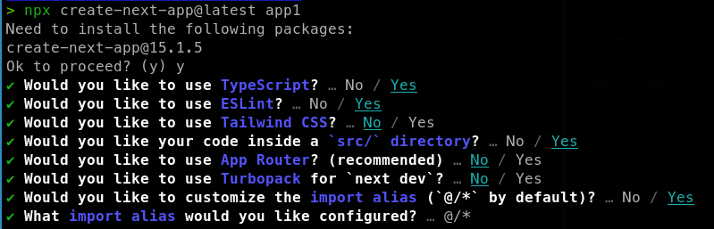
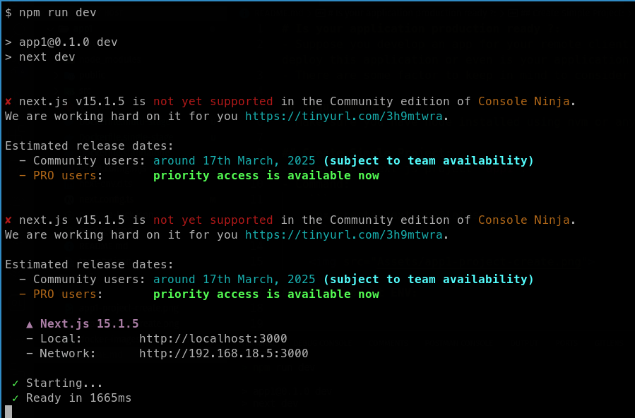
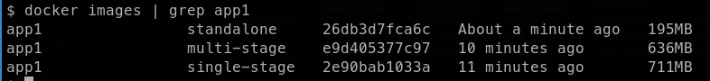
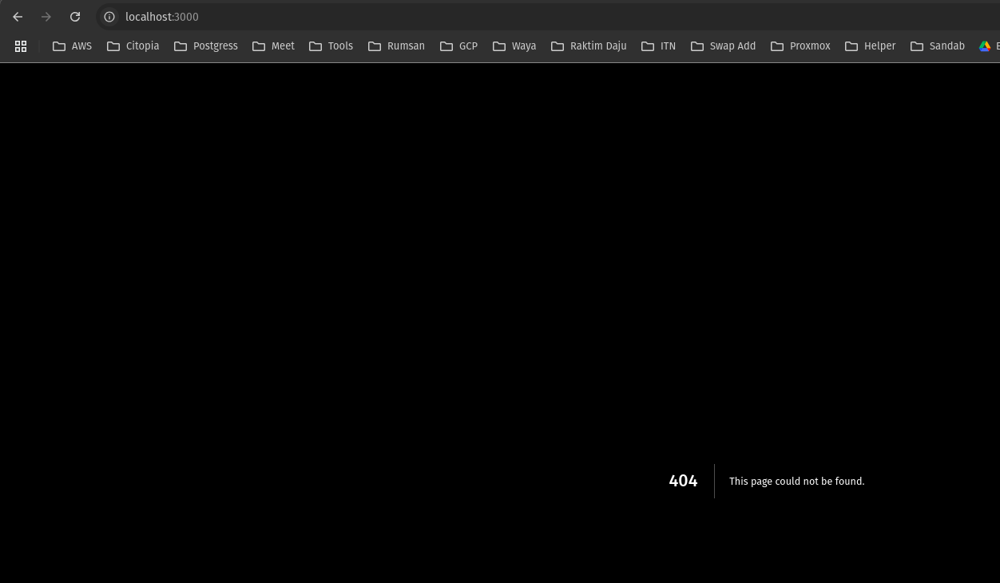
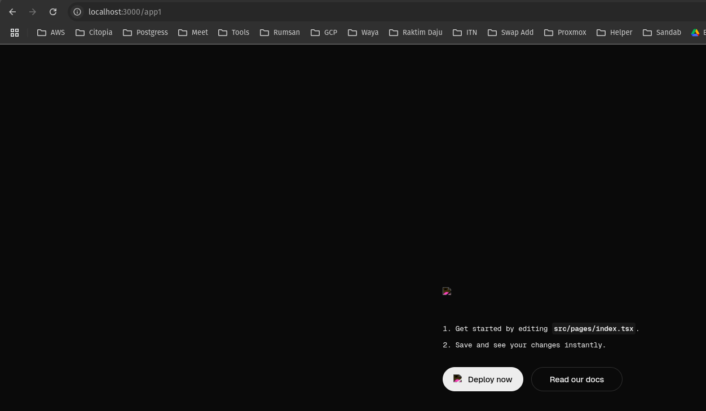
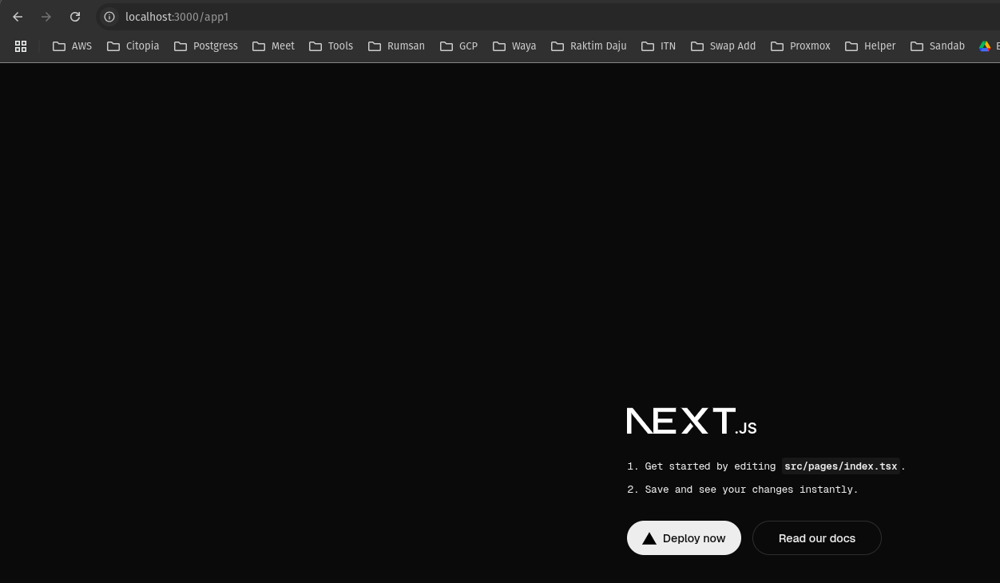
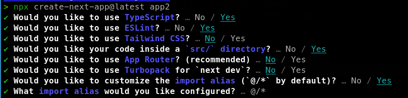

# Is your application production ready ?:
- Suppose you develop an app for your remote client. Once you hand over your code to client, are you sure you will not be bother by them regarding  how to deploy this application or even is your application ready to be deployed according to your client? 
- There are some factor to keep in mind to consider your application is fully developed.

## Requirements:
- Make sure you have node installed using nvm or any other package manager tools.

## Create Simple Project `app1`:
- Create one next js project `app1`:
- Command: 
    ```
    npx create-next-app@latest app1
    ```

    

### Development ENV:
- When testing application during development, we often start our app using `npm run dev` command.
- Command:
    ```ts
    npm run dev
    ```

    Output:

    

- App1 is running in [http://localhost:3000](http://localhost:3000).

- In Browser, visit [http://localhost:3000](http://localhost:3000) then simple next js UI will opens up:

    

- During development period, we skip eslint, types errors and so on.

### Production ENV:
- There are many factors that decides whether your application is production ready or not.

#### Migration Ready:
- Make sure your application can be deployed in many architecture environments.
- Contanerized your application using Dockerfile.

#### Light Weight 
- To make sure that your application is production ready, run `npm run build`. This command will generate production ready light weight artifact for next js application.
- Make use of Multi-Stage Dockerfile like `app1/Dockerfie.multi-stage` file.
- If you are using latest version of NEXT JS, they provide **standalone** output format which makes even more light weight. You can implement it, add `output: 'standalone',` into next config file like `app1/next.config.ts`. For more, visit this [link](https://nextjs.org/docs/pages/api-reference/config/next-config-js/output):
    ```ts
    module.exports = {
    output: 'standalone',
    }
    ```
- Dockerfile must be modified for standalone output like `app1/Dockerfile.standalone`.
- Here, you can see the difference between docker image size under 3 different type:

    

- From above result, we can see that standalone docker image is much more lesser in size which help in deploying quicker and can even save more data.

#### Subdirectory Deployment 
- Sometimes, many clients/organizations want to run many web app under same domain like example.com but in different subdirectory like:
    - app1: https://example.com/app1
    - app2: https://example.com/app2

- To make it happen, add below option inside next config file like `app1/next.config.ts`:
    ```ts
    module.exports = {
    basePath: '/app1',
    }
    ```

- Till now, our `app1/next.config.ts` file looks like below:
    ```ts
    import type { NextConfig } from "next";

    const nextConfig: NextConfig = {
    /* config options here */
    basePath: '/app1',
    output: 'standalone',
    reactStrictMode: true,

    };

- Make sure `npm run dev` is still running in your terminal. Then visit [http://localhost:3000](http://localhost:3000), you will get error like below:
    

- Since we have changes our baseUrl of our project. Now we have to visit [http://localhost:3000/app1](http://localhost:3000/app1)
    

- From above image, we can say that our app is loading in `/app1` but image is not displaying.

- Accoring to [Next JS documentation](https://nextjs.org/docs/app/api-reference/config/next-config-js/basePath):
    - **Links:** When linking to other pages using `next/link` and `next/router` the `basePath` will be automatically applied. For example, using `/about` will automatically become `/app1/about` when `basePath` is set to `/app1`.
        ```ts
        export default function HomePage() {
        return (
            <>
            <Link href="/about">About Page</Link>
            </>
        )
        }
        ```

    - **Images**: When using the `next/image` component, you will need to add the `basePath` in front of src. For example, using `/app1/me.png` will properly serve your image when `basePath` is set to `/app1`.
        ```ts
        import Image from 'next/image'
        
        function Home() {
        return (
            <>
            <h1>My Homepage</h1>
            <Image
                src="/app1/me.png"
                alt="Picture of the author"
                width={500}
                height={500}
            />
            <p>Welcome to my homepage!</p>
            </>
        )
        }
        
        export default Home
        ```

- We can not used hardcoded `basePath` value in every Image component, so will import it from `next.config` file and used it in `src/pages/index.tsx`:
    ```ts
    import nextConfig from "../../next.config";
    const basePath = nextConfig.basePath || '';

    ....
    <Image
    className={styles.logo}
    src={`${basePath}/next.svg`}
    alt="Next.js logo"
    width={180}
    height={38}
    priority
    />
    ```
- In above code, we have imported basePath value directly from next.config file. Then that value is passed as variable to src field.
- Here is complete `src/pages/index.tsx` file:
    <details><summary> Detailed Output </summary><blockquote>

    ~~~ts
    import Head from "next/head";
    import Image from "next/image";
    import { Geist, Geist_Mono } from "next/font/google";
    import styles from "@/styles/Home.module.css";

    import nextConfig from "../../next.config";
    const basePath = nextConfig.basePath || '';

    const geistSans = Geist({
    variable: "--font-geist-sans",
    subsets: ["latin"],
    });

    const geistMono = Geist_Mono({
    variable: "--font-geist-mono",
    subsets: ["latin"],
    });

    export default function Home() {
    return (
        <>
        <Head>
            <title>Create Next App</title>
            <meta name="description" content="Generated by create next app" />
            <meta name="viewport" content="width=device-width, initial-scale=1" />
            <link rel="icon" href={`${basePath}/favicon.ico`} />
        </Head>
        <div
            className={`${styles.page} ${geistSans.variable} ${geistMono.variable}`}
        >
            <main className={styles.main}>
            <Image
                className={styles.logo}
                src={`${basePath}/next.svg`}
                alt="Next.js logo"
                width={180}
                height={38}
                priority
            />
            <ol>
                <li>
                Get started by editing <code>src/pages/index.tsx</code>.
                </li>
                <li>Save and see your changes instantly.</li>
            </ol>

            <div className={styles.ctas}>
                <a
                className={styles.primary}
                href="https://vercel.com/new?utm_source=create-next-app&utm_medium=default-template&utm_campaign=create-next-app"
                target="_blank"
                rel="noopener noreferrer"
                >
                <Image
                    className={styles.logo}
                    src={`${basePath}/vercel.svg`}
                    alt="Vercel logomark"
                    width={20}
                    height={20}
                />
                Deploy now
                </a>
                <a
                href="https://nextjs.org/docs?utm_source=create-next-app&utm_medium=default-template&utm_campaign=create-next-app"
                target="_blank"
                rel="noopener noreferrer"
                className={styles.secondary}
                >
                Read our docs
                </a>
            </div>
            </main>
            <footer className={styles.footer}>
            <a
                href="https://nextjs.org/learn?utm_source=create-next-app&utm_medium=default-template&utm_campaign=create-next-app"
                target="_blank"
                rel="noopener noreferrer"
            >
                <Image
                aria-hidden
                src={`${basePath}/file.svg`}
                alt="File icon"
                width={16}
                height={16}
                />
                Learn
            </a>
            <a
                href="https://vercel.com/templates?framework=next.js&utm_source=create-next-app&utm_medium=default-template&utm_campaign=create-next-app"
                target="_blank"
                rel="noopener noreferrer"
            >
                <Image
                aria-hidden
                src={`${basePath}/window.svg`}
                alt="Window icon"
                width={16}
                height={16}
                />
                Examples
            </a>
            <a
                href="https://nextjs.org?utm_source=create-next-app&utm_medium=default-template&utm_campaign=create-next-app"
                target="_blank"
                rel="noopener noreferrer"
            >
                <Image
                aria-hidden
                src={`${basePath}/globe.svg`}
                alt="Globe icon"
                width={16}
                height={16}
                />
                Go to nextjs.org →
            </a>
            </footer>
        </div>
        </>
    );
    }
    ~~~

    </blockquote></details>

- Now we have to visit [http://localhost:3000/app1](http://localhost:3000/app1)
    


## [Optional] Create Another Project `app2`:
- Create one next js project `app2`:
- Command: 
    ```
    npx create-next-app@latest app2
    ```

    

- Modify `next.config.ts` file:
    ```ts
    import type { NextConfig } from "next";

    const nextConfig: NextConfig = {
    /* config options here */
    basePath: '/app2',
    output: 'standalone',
    reactStrictMode: true,

    };

    export default nextConfig;
    ```

- Copy and paste contents from `app1/src/pages/index.tsx` into `app2/src/pages/index.tsx`.
- Start app2 in dev mode [Stop app1 process or else error like Port already in Used might be shown]:
    ```ts
    npm run dev
    ```

- Now we have to visit [http://localhost:3000/app2](http://localhost:3000/app2)
    


## Proxy:
- To make both `app1` and `app2` working at the same time under same port you might need to used some proxy tool like nginx.
- In Production, these `app1` and `app2` will be running inside separate docker container so we might not need to be worry about error like `Port Already In Use`.